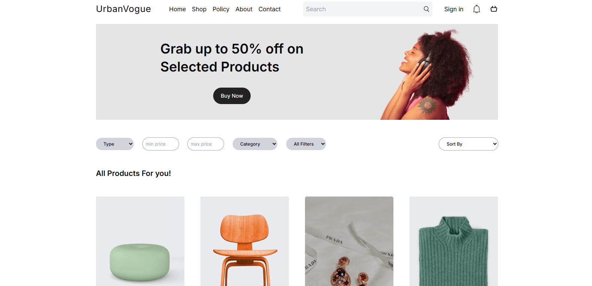
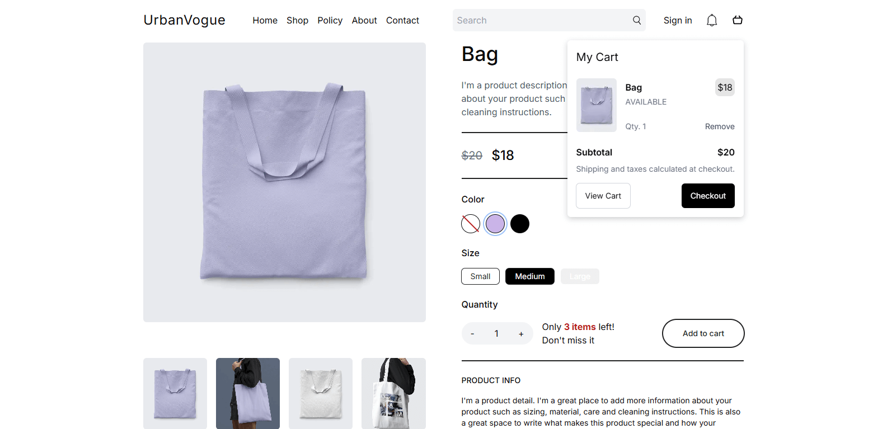

# **Full-Stack Next.js E-Commerce Platform**

This project is a fully responsive, full-stack e-commerce platform built with **Next.js**, optimized for **SEO** and seamless **backend integration**. The platform offers a smooth shopping experience with **dynamic product filtering**, **secure authentication**, and a **modern, visually appealing design**.

## **🔑 Authentication & Security**
To ensure a **fast and secure login experience**, the platform uses **Clerk** for authentication, providing an **efficient and user-friendly sign-in process**.

## **🛒 Product Management & Payments**
The project integrates **Wix Headless** for **easy product management**, enabling seamless **addition, updating, and organization of products**.  
The platform supports a **wide range of payment methods**, ensuring a **smooth checkout experience** for all users.

## **🔍 Advanced Product Filtering**
Users can easily find the products they need with a **powerful filtering system**, allowing searches based on:

- **Price range**
- **Category**
- **Product type** (digital or physical)

## **Modern UI & Responsive Design**
Built with **Tailwind CSS** and **Shadcn UI**, ensuring a **modern and sleek design**.

✅ **Fully responsive layout**, adapting to all screen sizes for an **optimal shopping experience**.  
✅ **Interactive slides** on the homepage enhance engagement, allowing users to **dynamically navigate through featured products**.

---

# Screenshots

This **Next.js e-commerce platform** offers **performance, security, and a seamless shopping experience**, making it an excellent foundation for any online store. 
